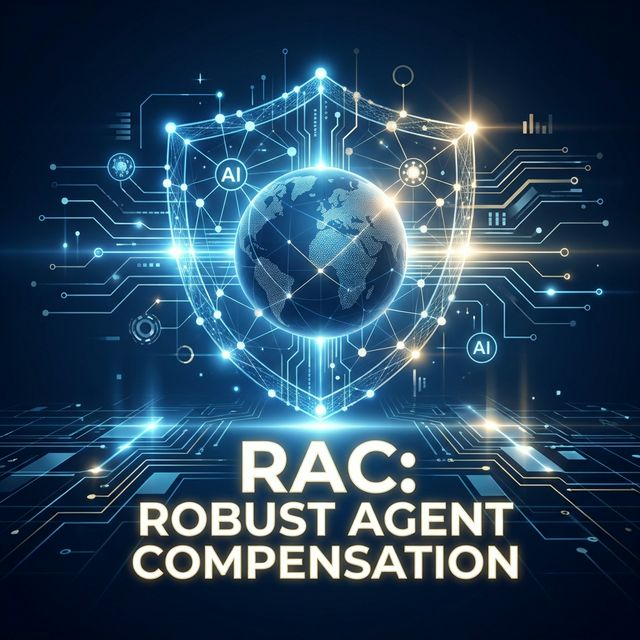

<div align="center">
  
  
  # Robust Agent Compensation (RAC)
  ### Teaching AI Agents to Compensate
  
  [](https://opensource.org/licenses/MIT)
  [](https://github.com/Kavirubc/tau2-bench)
  [](https://github.com/Kavirubc/REALM-Bench-PLUS)
</div>

---

> **Abstract**
>
> We present **Robust Agent Compensation (RAC)**, an architectural extension ensuring agentic execution never leaves side effects, even when faced with failures. The proposed approach can be implemented in most existing agent frameworks via their existing extension points. We present an implementation based on LangGraph, demonstrate its viability through the **τ²-bench** and **REALM-Bench**, and show that the approach is superior to state-of-the-art LLM-based planning approaches in both latency and token economy.

---

## 📖 Introduction

With the advent of language models, developers now have access to a wide variety of powerful AI models unlocking new use cases. However, implementing dependable "Groups of Agents" remains a challenge, especially when execution flows are dynamic (e.g., ReAct pattern). 

Steps or tools can fail, leaving **side effects**. A dependable execution platform should handle those side effects transparently. We propose **RAC**, a deterministic implementation that handles compensation-based recovery independent of the actions taken.

## 🏗️ Proposed Solution: RAC Architecture

RAC is an architectural extension applied to Agent frameworks to support robust execution by retrying, finding alternatives, and compensating when recovery fails.

### Architecture Components

1.  **Tool Interceptor**: Records all tool call events in a persistent Transaction Log.
2.  **Recovery and Compensation Manager (RCManager)**: Handles failures.
3.  **Error Interceptor**: Triggers the Rollback process.

### Algorithms

#### Algorithm 1: Tool Interceptor
```python
def tool_interceptor(tool_call, inputs):
    # Log the tool call start
    log_entry = transaction_log.start(tool_call, inputs)
    try:
        # Execute the tool
        result = execute_tool(tool_call, inputs)
        # Log successful completion
        transaction_log.complete(log_entry, result)
        return result
    except Exception as e:
        # Log failure and trigger recovery
        transaction_log.fail(log_entry, e)
        return RCManager.handle_failure(log_entry)
```

#### Algorithm 2: Handle Failure
```python
def handle_failure(failed_log_entry):
    if is_transient(failed_log_entry.error):
        # Retry logic
        return retry(failed_log_entry)
    
    # Try finding an alternative tool
    alternative = find_alternative(failed_log_entry)
    if alternative:
        return execute(alternative)
    
    # If all else fails, rollback
    return RCManager.rollback()
```

#### Algorithm 3: Rollback
```python
def rollback():
    # Rebuild execution tree from log
    execution_tree = transaction_log.get_tree()
    # Reverse the tree for compensation
    for action in reversed(execution_tree):
        compensation_pair = find_compensation_pair(action)
        if compensation_pair:
            # Extract parameters from previous inputs/outputs
            params = extract_params(action, compensation_pair)
            execute_compensation(compensation_pair, params)
```

## 💻 Implementation

We implemented RAC with **LangGraph**, using extension points to intercept pre- and post-tool invocation lifecycles. RAC can also be adapted to other frameworks like **Semantic Kernel** or **LlamaIndex**.

### Handling Compensation Pairs

RAC supports finding compensation actions via API or MCP annotations.

**1. Via Agent API**
```python
agent = create_comp_agent(
    model="gpt-4o",
    tools=[book_flight, cancel_flight, book_hotel, cancel_hotel],
    compensation_pairs={
        "book_flight": "cancel_flight",
        "book_hotel": "cancel_hotel",
    },
     state_mappers={
        "book_flight": lambda input, result: {"booking_ref": result["confirmation_ref"]},
        "book_hotel": lambda input, result: {"reservation_id": result["reservation_id"]}
    },
)
```

**2. Via MCP Annotation (JSON Patch)**
```json
[
  { "op": "add", "path": "/properties/x-compensation-tool", 
    "value": { 
      "type": "string"
    } ,
    "input-mapping": { 
      "type": "string"
    } 
  }
]
```

## 📊 Evaluation

We evaluated RAC against state-of-the-art solutions using two benchmarks:
1.  **τ²-bench**: Realistic customer service scenarios (Airline, Retail, Telecom).
2.  **REALM-Bench**: Real-world planning and scheduling scenarios (Logistics, Disaster Relief).

### Key Findings

| Metric | RAC | SagaLLM | LG (ReAct) | LG (Prompt Eng) |
| :--- | :--- | :--- | :--- | :--- |
| **Token Economy** | High | Low (due to replanning) | Medium | Medium |
| **Latency** | Low | High | Medium | Medium |
| **Success Rate (Dynamic)** | **High** | High (expensive) | Low | Low/Partial |
| **Side Effects** | **None** | None | Possible | Possible |

> **Note**: RAC demonstrates superior performance in handling dynamic failures (e.g., S-101, P12, P13) where vanilla ReAct agents fail, avoiding the expensive retry loops seen in planning-based approaches.

## 🔗 Links

*   [**τ²-bench Repository**](https://github.com/Kavirubc/tau2-bench)
*   [**REALM-Bench-PLUS Repository**](https://github.com/Kavirubc/REALM-Bench-PLUS)

## 📄 References

For full evaluation traces and detailed analysis, please refer to the `evaluation_results/` directory in the [REALM-Bench-PLUS repository](https://github.com/Kavirubc/REALM-Bench-PLUS).

---
*Created for the RAC Research Project, 2026.*
